As a developer from time and a time again you probably have to make some DNS configurations. But if you are like me, you probably do not think that much of a DNS, you just make the necessary configurations and be done with it (until you run into a DNS issues). Infact for this blog to run, i had to make those configurations and yet again I forget how to do everything and that kinda sparked an idea to do little research around the DNS. I managed to get my self into complete 'Red Herring' moment where I was debugging something for god knows how long until I decided to test my website on the phone and it worked flawlessly and I guess my issue was related to DNS cache.

## So what is DNS ?
At the core, DNS is often called phone book of the internet and it really is that, computer really doesn't understand the urls like we humans do, we write *www.google.com* to our browser and browser opens up a website. But computers are using the IP address which is like a phone number of individual computer you can use to call to and www.google.com is like just name in phone book to find the correct number. 

Now, the system is very simple but there is alot of small things i didn't know before i started to do little research (bear in mind that i've been basically living with the computers since i was 7 years old, so almost 30 years).

### Different DNS Records

Here are the most common DNS record types you'll find useful to understand, there is tons of more records. I actually did not understand the records before this blog post, i knew A record is holding ip address and TXT is used to verify domain is yours for example but thats about it, however these records I listed here are very common

- A Record: A maps domain to IPv4 address
- AAAA Record: AAAA maps domain to IPv6 address
- CNAME: CNAME is alias that points to another domain
- MX Record: MX is Domain mail server
- NS Record: NS is Domain nameserver
- TXT Record: TXT is often used for verification but is essentially text information

### Structure of domain name

You can break the domain into parts and thats actually how we find out the correct IP address to connect the website or server. 

There is a top level domain (TLD) that contains root which is represented with dot (.) and then we have different prefixes .fi or .jp that are also called top level domain. Next up in hierarchy we have domain name for example *google* or *yle* and lastly we have a host or hostname that is www for webserver or it can be mail or aspmx for mail and so on.

The DNS hierarchical tree structure lookd like this:

So if you write the url exactly as we write in tree structure *www.yle.fi.* it is working but you mostlikely never put the . after TLD .fi or .jp or any of them as the computer does it for us in the background. However when you configure the DNS it is important to add the root TLD if the service provider isn't doing it for you already.

## DNS Resolution Process

Next up, i want to go through what happens when you open up your browser and want to browse google.

When you type a URL into your browser, for example *www.google.com*. First url gets parsed and then checked if we already can find the ip from cache, if there is no cache for address you are looking for, we need to start recursive resolution

```mermaid
sequenceDiagram
    participant User as 👤 User Browser
    participant Resolver as 🔍 DNS Resolver
    participant Root as 🌐 Root Server
    participant TLD as 🏢 TLD Server (.com)
    participant Auth as 🏛️ Authoritative Server
    
    User->>Resolver: Query: www.google.com
    Note over User,Resolver: 1. User wants to visit www.google.com
    
    Resolver->>Root: Where is .com?
    Root->>Resolver: Ask TLD server (IP address)
    Note over Root,Resolver: 2. Root server points to .com TLD
    
    Resolver->>TLD: Where is google.com?
    TLD->>Resolver: Ask Auth server (IP address)
    Note over TLD,Resolver: 3. TLD server points to google.com auth server
    
    Resolver->>Auth: Where is www.google.com?
    Auth->>Resolver: Here's the IP: 142.250.191.14
    Note over Auth,Resolver: 4. Authoritative server returns actual IP
    
    Resolver->>User: IP: 142.250.191.14
    User->>User: Connect to 142.250.191.14
    Note over User: 5. Browser connects to Google's server
```

after we get the result from nameserver, the result is cached for later use. Lastly IP is returned to browser and browser connects to IP address. Finally the page is rendered.

### DNS issues

DNS is notorious for causing some Red Herrings. As I didn't have so much experience with DNS, I decided to have a chat with my coworker about DNS and he had an opinion that the most common day-to-day issues with DNS are related to Time-to-live (TTL) and incorrect configuration of DNS records. Too high TTL might cause issues as servers are waiting TTL to expire until re-querying for a update. 

Configuring DNS records also take some time to get into effect, so in my case I ended up debugging nothing because I miss configured my records and as TTL might be at the different states it takes a while to update all of the layers of process.
