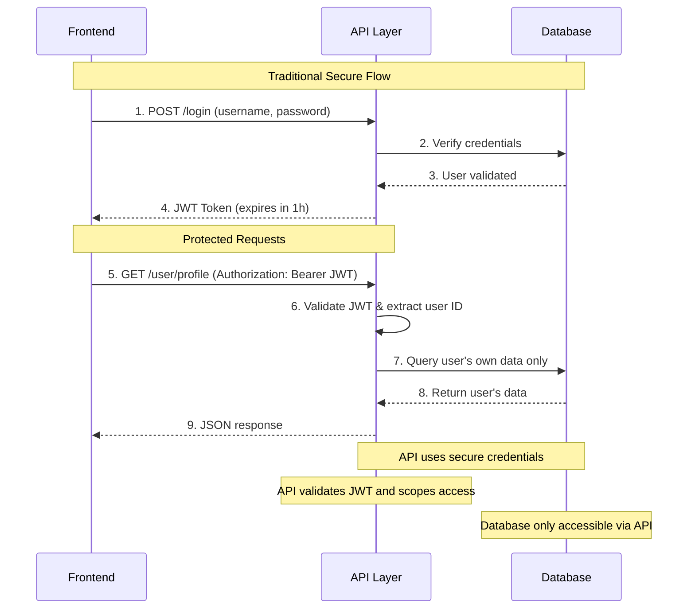
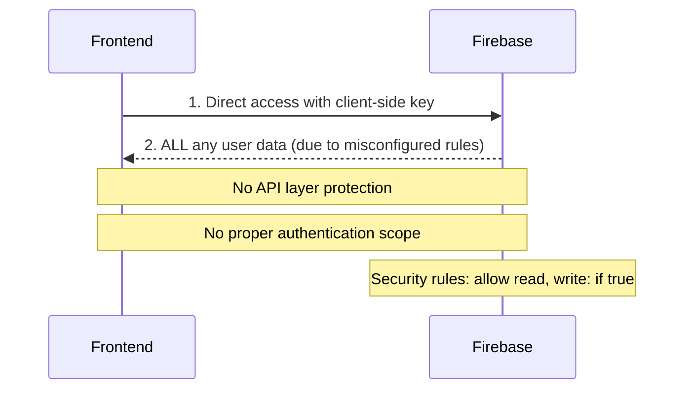

The first time I heard about the insident, I didn't know anything about the Tea app and I quickly find out why as I'm clearly not target the audience. It is women-only app to essentially dox men. App idea is very noble, to protect women from catfish, criminals and sex offenders and technically it is legal but it is very questionable and I'm very sure it is not available in EU as it would be GDPR nightmare for company behind it. I'm not here to judge the users of the app but rather giving my technical point of view.

This app was launched in 2023 and in my opinion it is debatable if the app is the product of vibe coding era or just pure incompetency. The term 'vibe coding' it self did not excist  the time of launching, but the LLMs surely were already available and I also used LLMs in my day to day job and knowing how bad code it produced I wouldn't be surprised if LLM models combined with incompetency had something to do with all this.

The insident caught my eye because I've been developing a SaaS web application for a few years and we use Firebase within our app. As a back-end developer I've been looking numerous issues with the Firebase not only security but also performance and I'm surprised how the service is still around. Simplicity it provides brings the dangers that the more Junior developers or vibe coders are prone to fall.

## The Breach

App was breached or should I say Firebase was miss configured and accessed by 4chan.

### Miss configured Firebase bucket

The developer aimed to verify that the user, a woman, was a real person, requiring a government-issued ID and a selfie. The app promised to delete the data post-verification, but it seems they didn’t follow through. They stated the breach involved images uploaded before February 2024, claiming sign-ups after that date were unaffected and no other user information was leaked.

Bucket that contained the selfies and pictures of IDs was configured in a way that allows all access to anyone who just happen to know what to look for. Now, this is very difficult to not notice in Firebase as it is notifying you if your bucket or database is configured in a such a harmful way and it reminds you about it too.

What makes it all worse is that EXIF metadata data was not pruned but the images were stored with the EXIF data. For those who don't know what the EXIF is, it is a metadata dump with information such as location, timestamps, camera it was taken with and such, this data allowed someone to build a map of locations of people.


### Not One, But Two Breaches

After the bucket was set on fire, somehow the second hit managed to be even more serious, what the... seems like there was absolutely no thoughts give to architecture nor security. 

According to other articles online, there was an API key involved with each user and with that API key user would have access to most recent database of user data including private messages and other meta data such as when the message was sent. What on earth is that ? Why would they use API key here. I might have an idea what had happened but I'm not quite sure.

Traditionally this is something like how communication is working with the database, notice there is no api key involved in front-end




There is an API layer between front-end and database and the API layer has selected endpoints open to public, for example sign up and sign-in. From those endpoints you get the initial access to app and json web token that holds somekind of expiration time and such a information with that jwt token you can access protected endpoints. 

Back-end is using api key or other more secure methods to access database layer and back-end is only resource that is able to read or write database. This is usually not the case with the Firebase. If you use their library, you can skip the back-end all-to-gether as Firebase is a Back-End as a Service. However, it is very very easy to configure the firebase in a way that user can read and write only data on your own document or document that user is allowed to. 

What I'm thinking is that the database was misconfigured or not configured at all and you could read any database with client-side api key, not only collections that use your unique user id as name of collection. This is just my two cents as the bucket configurations were also missing.




This is very simple to configure with security rules in Firestore (which I suspect they are using), simple approach would be something like this, use firebase auth (which it self has some flaws you need to take into a consideration), when user is created create user document with firebase generated uid, use that uid to access content that is meant to be limited to user. Here is simple rule for example:

```bash
rules_version = '2';
service cloud.firestore {
  match /databases/{database}/documents {

    match /users/{userUid} {
    	allow create, read: if request.auth.uid == userUid
    }
    match /users/{userUid}/profile {
        allow create, read, update: if request.auth.uid == userUid
    }
    match /users/{userUid}/orders/{orderId} {
    	allow read: if request.auth.uid == userUid
    }
  }
}
```

## This is only the begining

Like I said, there’s no clear evidence that this app was "vibe coded," but even if it was, this incident likely rooted from ignorance and incompetence. The developer probably used the Firebase library directly in the front-end and failed to properly configure the Firebase buckets or databases.

Firebase is extremely simple and user-friendly as a first cloud service, which, in my opinion, makes it dangerous for those who don’t know what they’re doing. It’s plug-and-play with zero security setup by default, which is a screaming for trouble.

These easy-to-integrate services are a great for vibe coders, and I think this is just the beginning as building speed for apps has gone up alot.

Stay safe! Catch you in the next one.


